# IKB42603 Cloud Computing Security Essentials

## Lab 3 --- Data Protection: Encryption & Key Management

**Student Name:**
Nur Shafiqa Binti Ab Rahim
**Student ID:**
52215124832
**Lab:** Lab 3\
**Topic:** Encryption & Key Management\
**Environment:** Windows, Git Bash, Docker Desktop, OpenSSL, AWS CLI,
LocalStack

------------------------------------------------------------------------

## 1. Introduction

This lab demonstrates data protection using symmetric and asymmetric
encryption, TLS, AWS KMS with envelope encryption, per-tenant keys and
cryptographic erasure, and SHA-256 hashing with a simple hash chain.

The practical work was completed using OpenSSL and LocalStack KMS.

------------------------------------------------------------------------

# Task 1 --- AES Symmetric Encryption

## Objective

Encrypt a text file using AES-256-CBC and verify that the decrypted file
matches the original.

## 1.1 Create the plaintext file

The file `record.txt` was created with:

``` text
Patient: Ahmad, Diagnosis: confidential
```

## 1.2 Encrypt the file

``` bash
openssl enc -aes-256-cbc -pbkdf2 -salt -in record.txt -out record.enc
```

The encrypted file was generated as `record.enc`.

**Evidence:** `Task1_AES_Encrypted.png`

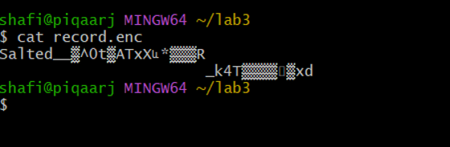

## 1.3 Decrypt the file

``` bash
openssl enc -d -aes-256-cbc -pbkdf2 -in record.enc -out record.dec.txt
```

## 1.4 Verify the decrypted file

``` bash
diff record.txt record.dec.txt && echo 'MATCH: decryption successful'
```

Output:

``` text
MATCH: decryption successful
```

**Evidence:** `Task1_AES_Decrypt_MATCH.png`

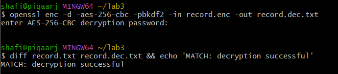

### Result

The decrypted file matched the original plaintext, confirming successful
AES encryption and decryption.

------------------------------------------------------------------------

# Task 2 --- RSA Asymmetric Cryptography

## Objective

Generate an RSA key pair, encrypt/decrypt the file, and create and
verify a digital signature.

## 2.1 Generate the RSA private key

``` bash
openssl genrsa -out private.pem 2048
```

## 2.2 Generate the public key

``` bash
openssl rsa -in private.pem -pubout -out public.pem
```

## 2.3 Encrypt using the public key

``` bash
openssl pkeyutl -encrypt -pubin -inkey public.pem -in record.txt -out record.rsa
```

## 2.4 Decrypt using the private key

``` bash
openssl pkeyutl -decrypt -inkey private.pem -in record.rsa -out record.rsa.txt
```

## 2.5 Create a digital signature

``` bash
openssl dgst -sha256 -sign private.pem -out record.sig record.txt
```

## 2.6 Verify the digital signature

``` bash
openssl dgst -sha256 -verify public.pem -signature record.sig record.txt
```

Output:

``` text
Verified OK
```

**Evidence:** `Task2_RSA_Signature_Verified.png`

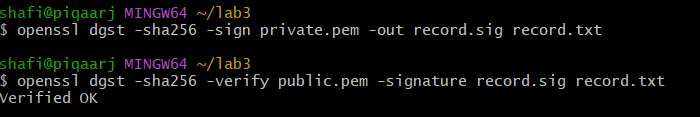

**Final verification evidence:** `Final_RSA_Verification.png`

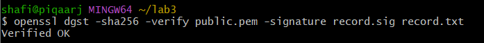

### Result

The RSA signature was successfully verified using the public key,
producing `Verified OK`.

------------------------------------------------------------------------

# Task 3 --- TLS / Encryption in Transit

## Objective

Protect data in transit using HTTPS and observe successful retrieval
over TLS.

## 3.1 Generate a self-signed TLS certificate

Because Git Bash on Windows can convert paths in some OpenSSL commands,
the certificate command was executed with path conversion disabled:

``` bash
MSYS_NO_PATHCONV=1 openssl req -x509 -newkey rsa:2048 -keyout key.pem -out cert.pem -days 7 -nodes -subj "/CN=localhost"
```

This generated:

-   `key.pem` --- private TLS key
-   `cert.pem` --- self-signed certificate

## 3.2 Configure Nginx for HTTPS

The Nginx configuration used was:

``` nginx
server {
    listen 443 ssl;
    server_name localhost;

    ssl_certificate /etc/nginx/cert.pem;
    ssl_certificate_key /etc/nginx/key.pem;

    location / {
        root /usr/share/nginx/html;
    }
}
```

The Nginx container was configured to expose HTTPS through port `8443`.

## 3.3 Test HTTPS access

``` bash
curl -k https://localhost:8443/record.txt
```

Output:

``` text
Patient: Ahmad, Diagnosis: confidential
```

**Evidence:** `Task3_TLS_HTTPS.png`

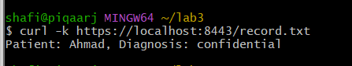

### Result

The file was successfully retrieved through an HTTPS connection,
demonstrating encryption in transit using TLS.

------------------------------------------------------------------------

# Task 4 --- Create and Use a KMS Master Key

## Objective

Create a KMS master key in LocalStack and use it to encrypt a small
secret.

## 4.1 Configure LocalStack endpoint

``` bash
EP='--endpoint-url=http://localhost:4566'
```

## 4.2 Create the Tenant-A master key

``` bash
aws $EP kms create-key --description "CCSE tenant-A master key"
```

Tenant-A KeyId:

``` text
f42ff216-50e1-4c4e-995f-d1083c0e06d0
```

The key was assigned to:

``` bash
KEY_A=f42ff216-50e1-4c4e-995f-d1083c0e06d0
```

**Evidence:** `Task4_KMS_Master_Key.png`

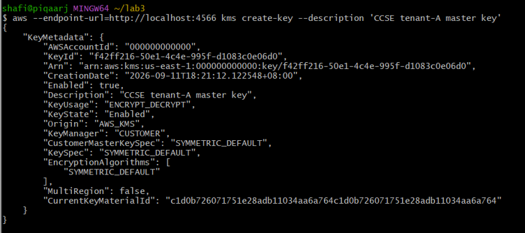

## 4.3 Encrypt a small secret with KMS

``` bash
aws $EP kms encrypt --key-id $KEY_A --plaintext "$(echo -n 'hello' | base64)" \
  --query CiphertextBlob --output text
```

**Evidence:** `Task4_KMS_Encrypt.png`

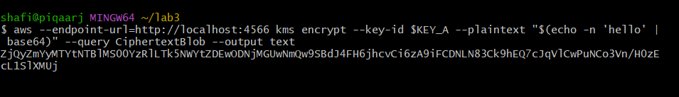

### Result

A LocalStack KMS master key was successfully created and used to encrypt
a small plaintext value.

------------------------------------------------------------------------

# Task 5 --- Envelope Encryption

## Objective

Use a KMS master key to generate a data key, encrypt data locally using
the plaintext data key, and retain only the KMS-wrapped copy of the data
key.

## 5.1 Generate a data key

``` bash
aws $EP kms generate-data-key --key-id $KEY_A --key-spec AES_256 \
  --query '[Plaintext,CiphertextBlob]' --output text
```

The two returned values were stored as:

-   Column 1 → `datakey.b64`
-   Column 2 → `datakey.enc`

For security, the plaintext data key and wrapped key values are covered
in the evidence screenshot.

**Evidence:** `Task5_Envelope_Data_Key.png`

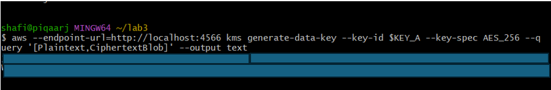

## 5.2 Decode the plaintext data key

``` bash
base64 -d datakey.b64 > datakey.bin
```

## 5.3 Encrypt the file locally

``` bash
openssl enc -aes-256-cbc -pbkdf2 -in record.txt -out record.env.enc \
  -pass file:./datakey.bin
```

**Evidence:** `Task5_Envelope_Encryption.png`

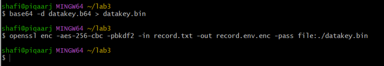

## 5.4 Destroy the plaintext data key from disk

``` bash
rm datakey.bin datakey.b64
```

Then:

``` bash
echo "Only the KMS-wrapped data key (datakey.enc) remains."
```

Output:

``` text
Only the KMS-wrapped data key (datakey.enc) remains.
```

**Evidence:** `Task5_Envelope_Cleanup.png`

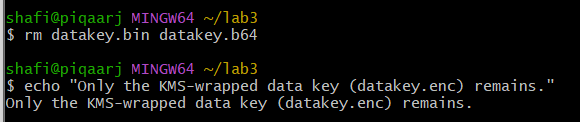

### Result

Envelope encryption was successfully demonstrated. The data was
encrypted locally using a generated data key, while the KMS-wrapped copy
was retained. The plaintext data key files were removed from disk.

------------------------------------------------------------------------

# Task 6 --- Per-Tenant Keys & Cryptographic Erasure

## Objective

Create a second tenant key and demonstrate that access to data protected
by Tenant-A's key can be made unrecoverable by disabling and scheduling
deletion of that key.

## 6.1 Create Tenant-B master key

``` bash
aws $EP kms create-key --description "CCSE tenant-B master key"
```

Tenant-B KeyId:

``` text
08f7b21e-0be9-4d57-81a5-49e3fcabf408
```

The key was created in the `Enabled` state.

**Evidence:** `Task6_TenantB_Key.png`

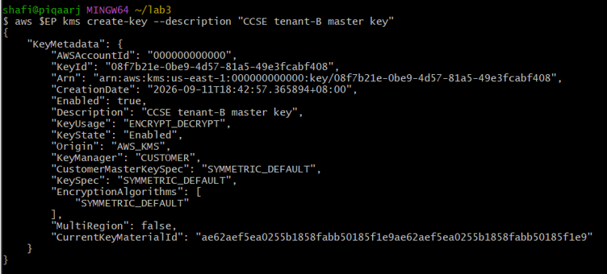

## 6.2 Schedule Tenant-A key deletion

``` bash
aws $EP kms schedule-key-deletion --key-id $KEY_A --pending-window-in-days 7
```

The key entered:

``` text
PendingDeletion
```

with a 7-day pending window.

**Evidence:** `Task6_TenantA_Scheduled_Deletion_Final.png`

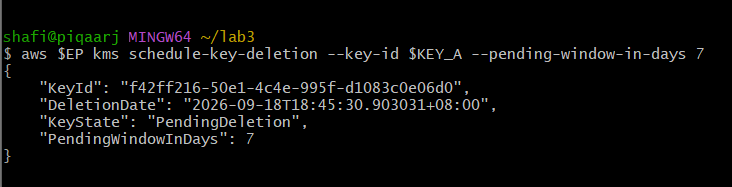

## 6.3 Disable Tenant-A key

The initial attempt to disable the key after scheduling deletion was
rejected because the key was already in `PendingDeletion`. The deletion
was therefore cancelled first, allowing the key to be disabled.

The successful command was:

``` bash
aws $EP kms disable-key --key-id $KEY_A
```

Verification:

``` bash
aws $EP kms describe-key --key-id $KEY_A --query 'KeyMetadata.KeyState'
```

Output:

``` text
"Disabled"
```

**Evidence:** `Task6_TenantA_Disabled.png`

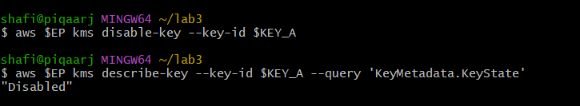

## 6.4 Schedule deletion again

``` bash
aws $EP kms schedule-key-deletion --key-id $KEY_A --pending-window-in-days 7
```

Output showed:

``` text
"KeyState": "PendingDeletion"
"PendingWindowInDays": 7
```

**Evidence:** `Task6_TenantA_Scheduled_Deletion_Final.png`


## 6.5 Attempt to unwrap the Tenant-A data key

``` bash
aws $EP kms decrypt --ciphertext-blob fileb://datakey.enc 2>&1 | head -3
```

The decrypt operation failed and LocalStack returned a
`NotFoundException` / invalid key ID error.

**Evidence:** `Task6_Crypto_Erasure_Failed_Decrypt.png`

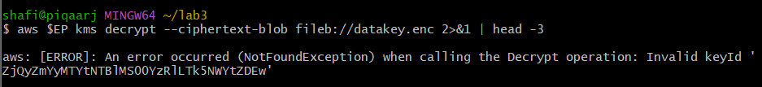

### Result

Tenant-A and Tenant-B used separate KMS keys. Tenant-A's key was
disabled and placed into the deletion process, and the subsequent
attempt to decrypt the wrapped data key failed.

------------------------------------------------------------------------

# Task 7 --- SHA-256 Integrity & Hash Chain

## Objective

Demonstrate file integrity using SHA-256 and create a simple
tamper-evident hash chain.

## 7.1 Calculate the original SHA-256 hash

``` bash
sha256sum record.txt
```

Original hash:

``` text
9345a32351cc1ad03e8b318059b753da6cd4e325688da97a01599b32bc945dd5
```

## 7.2 Modify a copy of the file

``` bash
cp record.txt tampered.txt
echo 'x' >> tampered.txt
```

## 7.3 Compare the hashes

``` bash
sha256sum record.txt tampered.txt
```

Results:

``` text
9345a32351cc1ad03e8b318059b753da6cd4e325688da97a01599b32bc945dd5  record.txt
8c8afc8a3e34425ab38ef90213102c638a82f756bd7187a03b306c5683065eb7  tampered.txt
```

The hashes are different even though only a small change was made to the
copied file.

**Evidence:** `Task7_SHA256_Tampered.png`

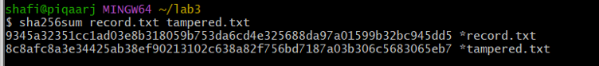

## 7.4 Build a hash chain

``` bash
PREV=0
for line in 'login ok' 'file read' 'export data'; do \
  PREV=$(echo -n "$PREV$line" | sha256sum | cut -d' ' -f1); \
  echo "$line | $PREV"; \
done
```

Output:

``` text
login ok | 573f9af26d45d395a1089ef5fec4d50ccddc17c0ea4269c2c91d90929a820053
file read | 6c3adc61ece69412b338e43d761435e95dbfc948253f8f600087b0a4c5ad2d3d
export data | e1470ccfaf43dcab3c17d5710dc9eacbb7ac65c9f522ca98c2c503431b32da68
```

**Evidence:** `Task7_Hash_Chain.png`

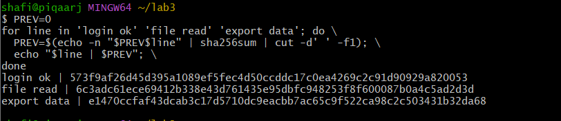

### Result

The SHA-256 hash changed after tampering, demonstrating integrity
checking. The hash chain linked each record to the previous hash, making
modifications detectable.

------------------------------------------------------------------------

# Final Verification

## Verify RSA signature

``` bash
openssl dgst -sha256 -verify public.pem -signature record.sig record.txt
```

Output:

``` text
Verified OK
```

**Evidence:** `Final_RSA_Verification.png`

## List LocalStack KMS keys

``` bash
aws $EP kms list-keys
```

The output showed two KMS keys:

``` text
f42ff216-50e1-4c4e-995f-d1083c0e06d0
08f7b21e-0be9-4d57-81a5-49e3fcabf408
```

**Evidence:** `Final_KMS_List_Keys.png`

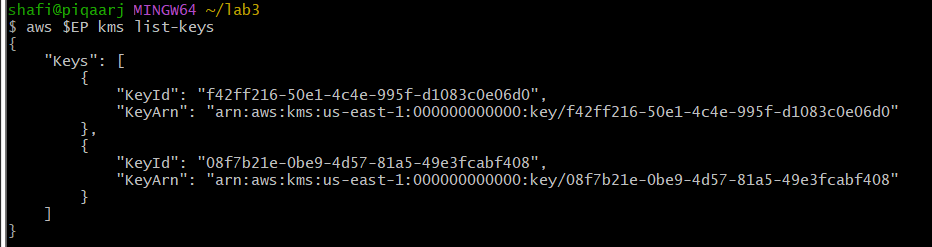

------------------------------------------------------------------------

# Short-Answer Questions

## Q1. Compare symmetric and asymmetric encryption: speed, key distribution, and typical use.

Symmetric encryption uses the same key for encryption and decryption. It
is fast and is suitable for encrypting large amounts of data, but the
secret key must be securely distributed to the parties that need it.

Asymmetric encryption uses a public/private key pair. It is slower than
symmetric encryption and solves the key-distribution problem because the
public key can be shared openly. It is commonly used for key exchange,
authentication, and digital signatures.

## Q2. Why is key management described as the weakest link, not the algorithm?

Strong encryption can still be compromised if cryptographic keys are
poorly protected, exposed, lost, or improperly distributed. Therefore,
securely creating, storing, using, rotating, disabling, and deleting
keys is essential to maintaining the security provided by the encryption
algorithm.

## Q3. Explain envelope encryption and why only the master key needs hardware-grade protection.

Envelope encryption uses a data key to encrypt the actual data locally.
The data key is then encrypted, or wrapped, by a KMS master key. The
encrypted data key can be stored with the encrypted data.

The master key is small and highly sensitive, so it can be protected
using stronger controls such as hardware-backed key protection. The
larger data is encrypted efficiently using the data key.

## Q4. How does cryptographic erasure achieve provable deletion where overwriting cannot in the cloud?

Cryptographic erasure makes encrypted data unrecoverable by destroying
or disabling the key required to decrypt it. In cloud environments,
physical storage may be replicated or managed by the provider, making
reliable physical overwriting difficult to prove. If the encryption key
is no longer usable, the encrypted data becomes effectively
unrecoverable.

## Q5. How does a hash chain make a log tamper-evident?

A hash chain includes the previous hash when calculating the next
record's hash. If an earlier record is changed, its hash changes and the
following links no longer match the original chain. This makes
unauthorized modification detectable.

------------------------------------------------------------------------

# Evidence Checklist

-   [x] AES encryption/decryption with `MATCH` confirmation
-   [x] RSA signature verification showing `Verified OK`
-   [x] HTTPS/TLS `curl -k` output
-   [x] KMS Tenant-A KeyId and encryption evidence
-   [x] Envelope encryption data-key generation
-   [x] Local envelope encryption
-   [x] Plaintext data-key cleanup
-   [x] Tenant-B KMS KeyId
-   [x] Tenant-A key disabled
-   [x] Tenant-A key scheduled for deletion
-   [x] Failed KMS decrypt attempt
-   [x] Different SHA-256 hashes before and after tampering
-   [x] Hash chain
-   [x] Final RSA verification
-   [x] Final KMS key listing

------------------------------------------------------------------------

# Screenshot Files

The following screenshots are intended to accompany this report:

1.  `Task1_AES_Encrypted.png`
2.  `Task1_AES_Decrypt_MATCH.png`
3.  `Task2_RSA_Signature_Verified.png`
4.  `Task3_TLS_HTTPS.png`
5.  `Task4_KMS_Master_Key.png`
6.  `Task4_KMS_Encrypt.png`
7.  `Task5_Envelope_Data_Key.png`
8.  `Task5_Envelope_Encryption.png`
9.  `Task5_Envelope_Cleanup.png`
10. `Task6_TenantB_Key.png`
11. `Task6_TenantA_Disabled.png`
12. `Task6_TenantA_Scheduled_Deletion_Final.png`
13. `Task6_Crypto_Erasure_Failed_Decrypt.png`
14. `Task7_SHA256_Tampered.png`
15. `Task7_Hash_Chain.png`
16. `Final_RSA_Verification.png`
17. `Final_KMS_List_Keys.png`

> **Security note:** Any screenshot containing plaintext cryptographic
> keys should be redacted before being uploaded to a public GitHub
> repository. The command and process should remain visible while the
> actual key material is covered.

------------------------------------------------------------------------

# Conclusion

Lab 3 successfully demonstrated encryption at rest using AES, asymmetric
cryptography and digital signatures using RSA, encryption in transit
using TLS, KMS-based envelope encryption, per-tenant key management and
cryptographic erasure, and integrity verification using SHA-256 and a
hash chain.

The practical exercises show that protecting cloud data requires not
only strong encryption algorithms but also proper key management, secure
transport, integrity checking, and controlled key lifecycle management.
