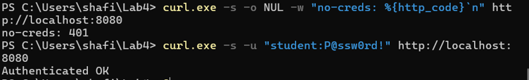
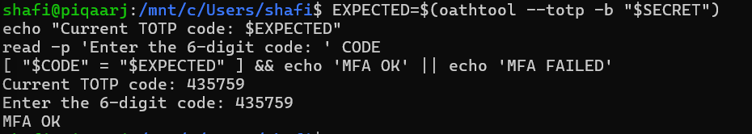
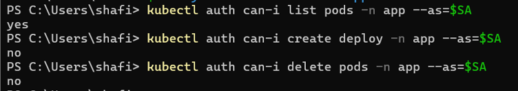
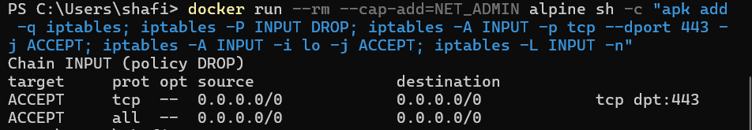
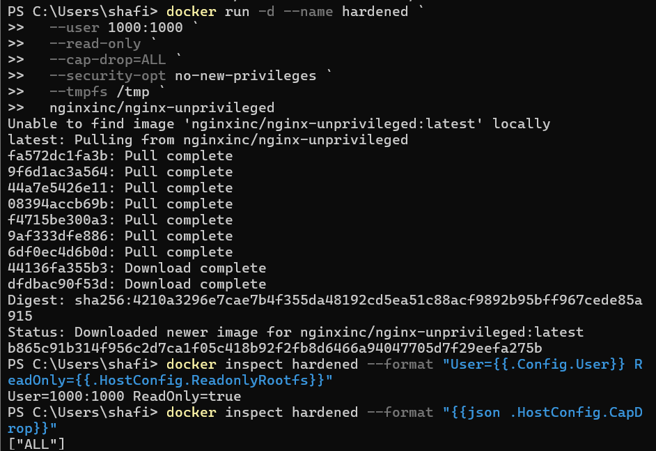
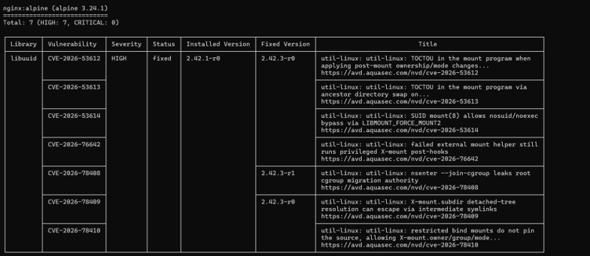

# IKB42603 Cloud Computing Security Essentials

## LAB 4 --- Access Control & Network Security

------------------------------------------------------------------------

## 1. Introduction

This lab focuses on **Access Control and Network Security** using Docker
and Kubernetes. The main areas covered are authentication, multi-factor
authentication (MFA), authorization through Kubernetes RBAC, network
segmentation, default-deny firewall rules, and container hardening.

The lab is divided into two main sessions:

-   **Session A:** Authentication, MFA and RBAC enforcement.
-   **Session B:** Network segmentation, firewall rules and container
    hardening.

The practical work demonstrates the principle of **least privilege**
across identity, network and container security.

------------------------------------------------------------------------

# 2. Lab Objectives

The objectives of this lab are:

1.  To distinguish between **authentication** and **authorization**.
2.  To implement password-based authentication for a web service.
3.  To implement and validate a **TOTP-based MFA** mechanism.
4.  To configure Kubernetes **RBAC** and verify allowed and denied
    actions.
5.  To implement Docker network segmentation between different service
    tiers.
6.  To demonstrate a **default-deny firewall** policy.
7.  To harden a container using non-root execution, a read-only
    filesystem, dropped Linux capabilities and `no-new-privileges`.
8.  To scan a container image for known vulnerabilities using Trivy.

------------------------------------------------------------------------

# 3. Environment and Tools

The lab was performed using:

-   Windows PowerShell
-   Docker
-   Kubernetes `kubectl`
-   Kind
-   Ubuntu through WSL for the TOTP tool
-   `oathtool`
-   Trivy

The Docker and Kubernetes environment was operated from PowerShell,
while Ubuntu/WSL was used for the Bash-based TOTP commands.

------------------------------------------------------------------------

# 4. Task 1 --- Authentication: Password-Protected Service

## 4.1 Objective

The objective of Task 1 is to demonstrate **authentication** using HTTP
Basic Authentication.

Authentication answers the question:

> **Who are you?**

The service should reject requests that do not contain valid credentials
and allow requests with the correct username and password.

------------------------------------------------------------------------

## 4.2 Create the Password File

A password file was created for the user `student` using `htpasswd`.

``` powershell
docker run --rm httpd:alpine htpasswd -nbB student 'P@ssw0rd!' | Out-File -FilePath .\htpasswd.txt -Encoding ascii
```

The password file was then used by Nginx as the authentication file.

------------------------------------------------------------------------

## 4.3 Create the Nginx Configuration

The Nginx configuration enabled HTTP Basic Authentication:

``` nginx
server {
    listen 80;

    location / {
        auth_basic "Restricted";
        auth_basic_user_file /etc/nginx/.htpasswd;

        root /usr/share/nginx/html;
        index index.html;
    }
}
```

The page returned after successful authentication contained:

``` text
Authenticated OK
```

------------------------------------------------------------------------

## 4.4 Run the Authentication Service

The service was started with the configuration, password file and HTML
page mounted into the container:

``` powershell
docker run --rm -d --name authsvc -p 8080:80 `
-v "${PWD}\default.conf:/etc/nginx/conf.d/default.conf" `
-v "${PWD}\htpasswd.txt:/etc/nginx/.htpasswd" `
-v "${PWD}\index.html:/usr/share/nginx/html/index.html" `
nginx
```

------------------------------------------------------------------------

## 4.5 Authentication Test

### Test without credentials

``` powershell
curl.exe -s -o NUL -w "no-creds: %{http_code}`n" http://localhost:8080
```

Output:

``` text
no-creds: 401
```

The HTTP status `401` shows that the unauthenticated request was
rejected.

### Test with valid credentials

``` powershell
curl.exe -s -u "student:P@ssw0rd!" http://localhost:8080
```

Output:

``` text
Authenticated OK
```

The successful response shows that the supplied credentials were valid.

## 4.6 Evidence



**Figure 1.** HTTP Basic Authentication test showing `401` when no
credentials are provided and successful authentication when valid
credentials are supplied.

### Result

Task 1 successfully demonstrated password-based authentication:

-   Unauthenticated request → **401 Unauthorized**
-   Valid credentials → **Authenticated OK**

------------------------------------------------------------------------

# 5. Task 2 --- MFA / TOTP

## 5.1 Objective

The objective of Task 2 is to add a second authentication factor using a
**Time-based One-Time Password (TOTP)**.

MFA combines authentication factors from different classes. In this
task, the password represents something the user knows, while the TOTP
code provides an additional factor.

------------------------------------------------------------------------

## 5.2 Generate a TOTP Secret

The TOTP secret was generated using Bash:

``` bash
SECRET=$(head -c20 /dev/urandom | base32)
```

The secret was then displayed for enrolment:

``` bash
echo "Enrol this secret in an authenticator app: $SECRET"
```

A current six-digit TOTP code was generated using:

``` bash
oathtool --totp -b "$SECRET"
```

The code changes periodically because it is time-based.

------------------------------------------------------------------------

## 5.3 Validate the MFA Code

To avoid the TOTP code changing during the comparison, the generated
code was stored first:

``` bash
EXPECTED=$(oathtool --totp -b "$SECRET")
echo "Current TOTP code: $EXPECTED"
read -p 'Enter the 6-digit code: ' CODE
[ "$CODE" = "$EXPECTED" ] && echo 'MFA OK' || echo 'MFA FAILED'
```

Successful output:

``` text
Current TOTP code: 435759
Enter the 6-digit code: 435759
MFA OK
```

## 5.4 Evidence



**Figure 2.** Successful TOTP validation showing the entered six-digit
code and `MFA OK`.

### Result

The TOTP code was successfully validated, demonstrating that a second
factor can be added to password-based authentication.

------------------------------------------------------------------------

# 6. Task 3 --- Authorization: Kubernetes RBAC

## 6.1 Objective

Task 3 demonstrates **authorization** using Kubernetes Role-Based Access
Control (RBAC).

Authorization answers the question:

> **What are you allowed to do?**

A developer ServiceAccount was created and given only the permissions
required to read pods.

------------------------------------------------------------------------

## 6.2 Create the Kubernetes Cluster

A Kind cluster was created:

``` powershell
kind create cluster --name ccse-lab4
```

The cluster was successfully created and the kubectl context was set to:

``` text
kind-ccse-lab4
```

------------------------------------------------------------------------

## 6.3 Create the Namespace

``` powershell
kubectl create namespace app
```

Output:

``` text
namespace/app created
```

------------------------------------------------------------------------

## 6.4 Create the Developer ServiceAccount

``` powershell
kubectl create serviceaccount dev -n app
```

Output:

``` text
serviceaccount/dev created
```

------------------------------------------------------------------------

## 6.5 Create the Restricted Role

The developer role was configured with only `get` and `list` permissions
for pods:

``` powershell
kubectl create role dev-role -n app --verb=get,list --resource=pods
```

This means the developer can retrieve and list pod information but does
not receive permissions to create deployments or delete pods.

------------------------------------------------------------------------

## 6.6 Create the RoleBinding

The role was assigned to the developer ServiceAccount:

``` powershell
kubectl create rolebinding dev-rb -n app --role=dev-role --serviceaccount=app:dev
```

The ServiceAccount identity was then stored:

``` powershell
$SA="system:serviceaccount:app:dev"
```

------------------------------------------------------------------------

## 6.7 Authorization Tests

### Test 1 --- List Pods

``` powershell
kubectl auth can-i list pods -n app --as=$SA
```

Result:

``` text
yes
```

### Test 2 --- Create Deployment

``` powershell
kubectl auth can-i create deploy -n app --as=$SA
```

Result:

``` text
no
```

### Test 3 --- Delete Pods

``` powershell
kubectl auth can-i delete pods -n app --as=$SA
```

Result:

``` text
no
```

## 6.8 Evidence



**Figure 3.** Kubernetes RBAC authorization checks showing that the
developer can list pods but cannot create deployments or delete pods.

### Result

The RBAC configuration successfully enforced least privilege:

  Action              Result
  ------------------- -------------
  List pods           **Allowed**
  Create deployment   **Denied**
  Delete pods         **Denied**

This demonstrates the difference between authentication and
authorization. The ServiceAccount can be identified, but its permissions
are still restricted by the assigned Role.

------------------------------------------------------------------------

# 7. Task 4 --- Network Segmentation

## 7.1 Objective

Task 4 demonstrates network segmentation using separate Docker networks.

The intended three-tier structure is:

``` text
Web / Frontend
      |
frontend-net
      |
     App
      |
backend-net
      |
     DB
```

The web tier should not be able to directly access the database. The
application tier should be able to communicate with the database.

------------------------------------------------------------------------

## 7.2 Create the Docker Networks

``` powershell
docker network create frontend-net
docker network create backend-net
```

The `backend-net` network was already present during the setup attempt,
so Docker returned a message indicating that it already existed. The
existing network was reused.

------------------------------------------------------------------------

## 7.3 Create the Database Container

``` powershell
docker run -d --name db --network backend-net redis:alpine
```

The Redis database container was connected only to the backend network.

------------------------------------------------------------------------

## 7.4 Create the Application Container

``` powershell
docker run -d --name app --network backend-net nginx
```

The application was then connected to the frontend network as well:

``` powershell
docker network connect frontend-net app
```

Therefore, the application could communicate with both tiers.

------------------------------------------------------------------------

## 7.5 Create the Web Container

``` powershell
docker run -d --name web --network frontend-net nginx
```

The web container was connected only to `frontend-net`.

------------------------------------------------------------------------

## 7.6 Connectivity Testing

Netcat was installed inside the `web` and `app` containers to test TCP
connectivity to the Redis database port:

``` powershell
docker exec web sh -c "apt-get update -qq && apt-get install -y -qq netcat-openbsd"
```

``` powershell
docker exec app sh -c "apt-get update -qq && apt-get install -y -qq netcat-openbsd"
```

### Web to Database

``` powershell
docker exec web sh -c "nc -z -w3 db 6379 && echo REACHABLE || echo BLOCKED"
```

Result:

``` text
BLOCKED
```

### Application to Database

``` powershell
docker exec app sh -c "nc -z -w3 db 6379 && echo REACHABLE || echo BLOCKED"
```

Result:

``` text
Connection to db (172.20.0.2) 6379 port [tcp/*] succeeded!
REACHABLE
```

## 7.7 Evidence


**Figure 4.** Network segmentation test showing that the web tier is
blocked from the database while the application tier can reach the
database.

### Result

The network segmentation successfully limited direct access to the
database:

-   `web → db` = **BLOCKED**
-   `app → db` = **REACHABLE**

If the web service were compromised, the segmentation would reduce the
attacker's ability to directly communicate with the database tier.

------------------------------------------------------------------------

# 8. Task 5 --- Firewall Rules: Default-Deny

## 8.1 Objective

Task 5 demonstrates a **default-deny firewall** model.

A default-deny policy means that traffic is rejected unless an explicit
rule permits it.

This is similar to the principle used by cloud security groups, where
only required traffic is allowed.

------------------------------------------------------------------------

## 8.2 Configure the Firewall

A temporary Alpine container was used with the `NET_ADMIN` capability:

``` powershell
docker run --rm --cap-add=NET_ADMIN alpine sh -c "apk add -q iptables; iptables -P INPUT DROP; iptables -A INPUT -p tcp --dport 443 -j ACCEPT; iptables -A INPUT -i lo -j ACCEPT; iptables -L INPUT -n"
```

The important configuration was:

``` text
INPUT policy = DROP
TCP port 443 = ACCEPT
Loopback = ACCEPT
```

------------------------------------------------------------------------

## 8.3 Firewall Output

The resulting ruleset showed:

``` text
Chain INPUT (policy DROP)

ACCEPT tcp ... tcp dpt:443
ACCEPT all ...
```

## 8.4 Evidence



**Figure 5.** Default-deny firewall configuration showing the INPUT
policy as `DROP` and an explicit allow rule for TCP port 443.

### Result

The firewall follows least privilege because the default policy blocks
traffic and only explicitly required traffic is allowed.

------------------------------------------------------------------------

# 9. Task 6 --- Container / Host Hardening

## 9.1 Objective

Task 6 reduces the attack surface of a container by applying several
hardening controls.

The hardened container was configured with:

-   Non-root user
-   Read-only root filesystem
-   All Linux capabilities dropped
-   `no-new-privileges`
-   Temporary writable `/tmp`
-   Unprivileged Nginx image

------------------------------------------------------------------------

## 9.2 Run the Hardened Container

``` powershell
docker run -d --name hardened `
  --user 1000:1000 `
  --read-only `
  --cap-drop=ALL `
  --security-opt no-new-privileges `
  --tmpfs /tmp `
  nginxinc/nginx-unprivileged
```

The `nginxinc/nginx-unprivileged` image was downloaded and the container
was started successfully.

------------------------------------------------------------------------

## 9.3 Verify User and Read-Only Filesystem

``` powershell
docker inspect hardened --format "User={{.Config.User}} ReadOnly={{.HostConfig.ReadonlyRootfs}}"
```

Output:

``` text
User=1000:1000 ReadOnly=true
```

This confirms:

-   The service is running as user `1000:1000` rather than root.
-   The container root filesystem is read-only.

------------------------------------------------------------------------

## 9.4 Verify Dropped Capabilities

``` powershell
docker inspect hardened --format "{{json .HostConfig.CapDrop}}"
```

Output:

``` text
["ALL"]
```

This confirms that all Linux capabilities were dropped.

------------------------------------------------------------------------

## 9.5 Evidence --- Container Hardening



**Figure 6.** Container inspection showing non-root execution, a
read-only root filesystem and all capabilities dropped.

------------------------------------------------------------------------

## 9.6 Hardening Measures and Security Benefits

  ------------------------------------------------------------------------
  Hardening measure                    Security benefit
  ------------------------------------ -----------------------------------
  `--user 1000:1000`                   Prevents the service from running
                                       as root and reduces the impact of
                                       privilege-related attacks.

  `--read-only`                        Prevents normal processes from
                                       modifying the root filesystem,
                                       reducing the ability to persist
                                       changes.

  `--cap-drop=ALL`                     Removes unnecessary Linux
                                       capabilities and reduces the
                                       privileges available to an
                                       attacker.

  `--security-opt no-new-privileges`   Prevents processes from gaining
                                       additional privileges.

  `--tmpfs /tmp`                       Provides a temporary writable area
                                       while keeping the main root
                                       filesystem read-only.

  `nginxinc/nginx-unprivileged`        Uses an unprivileged Nginx image to
                                       reduce the privileges of the
                                       service.
  ------------------------------------------------------------------------

------------------------------------------------------------------------

# 10. Trivy Vulnerability Scan

## 10.1 Objective

The container image was scanned for known vulnerabilities using Trivy.

The scan focused on HIGH and CRITICAL severity vulnerabilities:

``` powershell
docker run --rm aquasec/trivy image --severity HIGH,CRITICAL nginx:alpine
```

------------------------------------------------------------------------

## 10.2 Scan Result

The scan reported:

``` text
nginx:alpine (Alpine 3.24.1)

Total: 7 (HIGH: 7, CRITICAL: 0)
```

The scan identified seven HIGH severity vulnerabilities and no CRITICAL
severity vulnerabilities in the scanned image.

## 10.3 Evidence



**Figure 7.** Trivy scan summary for the `nginx:alpine` image showing 7
HIGH and 0 CRITICAL vulnerabilities.

### Result

The scan provides visibility into known vulnerabilities within the
container image. Image scanning can be used to identify packages that
require updating or remediation before deployment.

------------------------------------------------------------------------

# 11. Short-Answer Questions

## Q1. Explain the difference between authentication and authorization using Tasks 1 and 3.

Authentication and authorization are related but perform different
functions.

**Authentication** verifies the identity of a user or account. In Task
1, HTTP Basic Authentication was used. When no credentials were
provided, the service returned `401 Unauthorized`. When the correct
username and password were provided, the service returned
`Authenticated OK`.

**Authorization** determines what an authenticated identity is allowed
to do. In Task 3, the Kubernetes developer ServiceAccount was given a
restricted Role. The account was allowed to list pods but was denied
permission to create deployments and delete pods.

Therefore, Task 1 demonstrates **who the user is**, while Task 3
demonstrates **what that user is allowed to do**.

------------------------------------------------------------------------

## Q2. Why is MFA so effective, and which attacks does it defeat?

MFA is effective because an attacker needs more than one authentication
factor to gain access. Obtaining a password alone is not sufficient when
a second factor such as a TOTP code is required.

In this lab, the TOTP code was generated based on a shared secret and
changed periodically. This provides an additional factor beyond the
password.

MFA can significantly reduce the effectiveness of attacks involving
stolen or reused passwords, including credential stuffing and password
theft. However, MFA does not protect against every possible attack.

------------------------------------------------------------------------

## Q3. How does network segmentation limit the damage of a compromised web server?

Network segmentation separates different services into isolated network
zones.

In Task 4, the web container was connected only to `frontend-net`, while
the database was connected only to `backend-net`. The application
container was connected to both networks.

As a result:

``` text
web → db = BLOCKED
app → db = REACHABLE
```

If an attacker compromises the web server, the attacker cannot directly
communicate with the database through the web container. This reduces
lateral movement and helps contain the compromise.

------------------------------------------------------------------------

## Q4. What does a default-deny firewall policy achieve, and how does it relate to cloud security groups?

A default-deny firewall policy blocks traffic unless a specific rule
permits it.

In Task 5, the INPUT chain used:

``` text
policy DROP
```

and TCP port 443 was explicitly allowed.

This implements the principle of least privilege at the network level.
Cloud security groups use a similar concept by defining which network
traffic is permitted instead of allowing unrestricted access.

------------------------------------------------------------------------

## Q5. List the hardening measures you applied and the attack surface each one removes.

The main hardening measures were:

### 1. Non-root execution

The container was run as:

``` text
1000:1000
```

This reduces the impact of an attacker gaining control of the
application because the compromised process does not automatically have
root privileges.

### 2. Read-only filesystem

The root filesystem was configured as:

``` text
ReadOnly=true
```

This limits an attacker's ability to modify files, install persistent
changes or alter the container filesystem.

### 3. Dropped capabilities

All Linux capabilities were removed:

``` text
["ALL"]
```

This reduces the number of privileged kernel operations available to a
compromised process.

### 4. No-new-privileges

The `no-new-privileges` security option prevents processes from gaining
additional privileges.

### 5. Unprivileged Nginx image

The `nginxinc/nginx-unprivileged` image was used to reduce unnecessary
privileges for the web service.

### 6. Image vulnerability scanning

Trivy was used to identify known vulnerabilities in the image so that
vulnerable packages can be reviewed and remediated.

------------------------------------------------------------------------

# 12. Verification Commands

The lab also provides verification commands to confirm the RBAC and
container hardening configurations.

## 12.1 Verify the Kubernetes RoleBinding

``` powershell
kubectl get rolebinding dev-rb -n app -o yaml
```

This can be used to verify that `dev-rb` exists in the `app` namespace
and is associated with the `dev-role` and the `dev` ServiceAccount.

## 12.2 Verify Dropped Capabilities

``` powershell
docker inspect hardened --format "{{json .HostConfig.CapDrop}}"
```

Expected result:

``` text
["ALL"]
```

------------------------------------------------------------------------

# 13. Evidence Summary

The following evidence was collected for the lab:

  ----------------------------------------------------------------------------------
  Task                    Evidence file                      Main result
  ----------------------- ---------------------------------- -----------------------
  Task 1                  `task1_authentication.png`         `401` without
                                                             credentials and
                                                             successful
                                                             authentication with
                                                             valid credentials

  Task 2                  `task2_mfa.png`                    `MFA OK`

  Task 3                  `task3_rbac.png`                   `yes`, `no`, `no`
                                                             authorization results

  Task 4                  `task4_network_segmentation.png`   `BLOCKED` and
                                                             `REACHABLE`

  Task 5                  `task5_firewall.png`               INPUT `DROP` and
                                                             explicit TCP/443 allow

  Task 6                  `task6_hardening.png`              Non-root, read-only
                                                             filesystem and dropped
                                                             capabilities

  Task 6                  `task6_trivy.png`                  7 HIGH, 0 CRITICAL
                                                             vulnerabilities
  ----------------------------------------------------------------------------------

------------------------------------------------------------------------

# 14. Security Best-Practices Checklist

The following controls were demonstrated during the lab:

-   [x] Service requires authentication.
-   [x] MFA / second factor implemented and validated.
-   [x] Authorization enforced using Kubernetes RBAC.
-   [x] Least-privilege permissions applied to the developer
    ServiceAccount.
-   [x] Network segmented so the database is unreachable from the web
    tier.
-   [x] Default-deny firewall policy demonstrated.
-   [x] Explicit allow rule configured for required traffic.
-   [x] Container runs as a non-root user.
-   [x] Container root filesystem is read-only.
-   [x] Linux capabilities are dropped.
-   [x] `no-new-privileges` is enabled.
-   [x] Container image scanned for known vulnerabilities.

------------------------------------------------------------------------

# 15. Conclusion

This lab demonstrated several important cloud security controls across
identity, authorization, networking and container security.

First, HTTP Basic Authentication was used to ensure that unauthenticated
requests were rejected. MFA was then implemented using TOTP to provide
an additional authentication factor.

Kubernetes RBAC was used to enforce authorization and least privilege.
The developer ServiceAccount could list pods but was not allowed to
create deployments or delete pods.

Network segmentation was demonstrated using separate frontend and
backend Docker networks. The web tier could not directly reach the
database, while the application tier could communicate with it. A
default-deny firewall model was also implemented to allow only required
network traffic.

Finally, the Nginx container was hardened using non-root execution, a
read-only filesystem, dropped capabilities, `no-new-privileges`, and an
unprivileged image. Trivy was used to identify known vulnerabilities in
the container image.

Overall, the lab shows how multiple security controls can work together
to reduce unauthorized access, limit lateral movement, apply least
privilege and reduce the attack surface of containerized workloads.

------------------------------------------------------------------------

# 16. References

-   IKB42603 Cloud Computing Security Essentials --- Lab 4: Access
    Control & Network Security.
-   Docker Security Documentation --- `docs.docker.com/engine/security`
-   CIS Docker / Kubernetes Benchmarks --- `www.cisecurity.org`
-   Cloud Security Alliance (CSA) Security Guidance v5 ---
    Infrastructure & Networking; IAM
