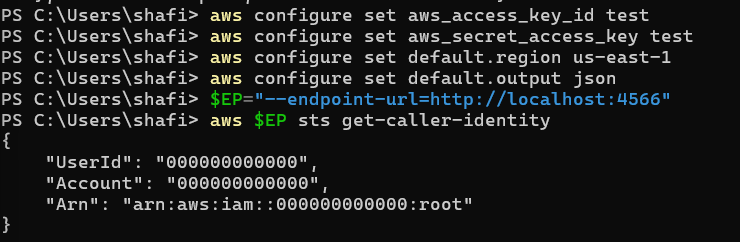
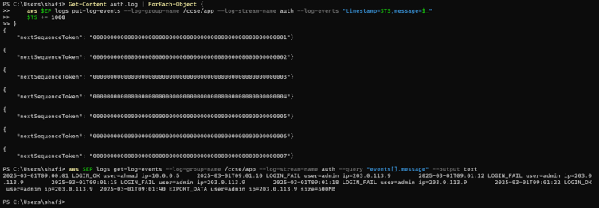
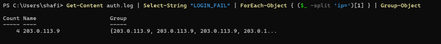
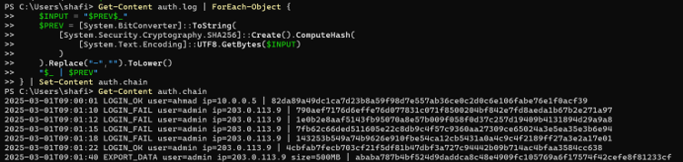
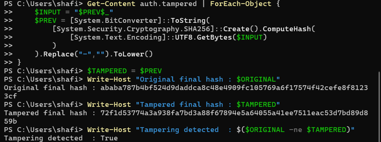
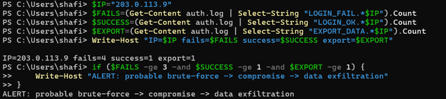
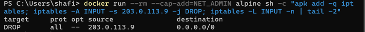
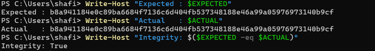

# Lab 5: Monitoring, Logging & Incident Detection

**Course:** IKB42603 Cloud Computing Security Essentials  
**Topic:** Monitoring, Logging & Incident Detection  
**Weeks:** 9–10  
**Tools:** Docker, LocalStack, AWS CLI, PowerShell  
**Environment:** Windows 11 / PowerShell  
**Name:** Nur Shafiqa binti Ab Rahim  
**Student ID:** 52215124832  
**Date:** 09/09/2026

---

## Lab Summary / Objective

This lab demonstrates monitoring, logging, security-event querying, tamper-evident logs, incident detection and incident response using Docker and LocalStack.

The main objectives are:

- Collect and centralise application logs.
- Distinguish between logs and events and query security activity.
- Build a SHA-256 hash-chained log and detect alteration.
- Detect an incident by correlating multiple related events.
- Perform incident response through detection, containment, evidence collection, integrity verification and documentation.

---

## Architecture Diagram

```text
                 Monitoring, Logging & Incident Detection
                                LAB 5
                                  │
              ┌───────────────────┼───────────────────┐
              │                   │                   │
        SESSION A             SESSION B          INCIDENT
       Logging & Query       Integrity &          Response
        Tasks 1–3             Detection           Task 6
              │                   │                   │
              ▼                   ▼                   ▼
        ┌───────────┐       ┌─────────────┐    ┌──────────────┐
        │ auth.log  │       │ auth.chain  │    │ Correlation  │
        │           │       │ SHA-256     │    │ Alert        │
        │ LOGIN_OK  │       │ hash chain  │    │              │
        │ LOGIN_FAIL│       │             │    │ 4 FAIL       │
        │ EXPORT    │       │ auth.tampered│   │ 1 SUCCESS    │
        └─────┬─────┘       └─────────────┘    │ 1 EXPORT     │
              │                                └──────┬───────┘
              ▼                                       │
      ┌────────────────┐                              ▼
      │ LocalStack      │                       ┌──────────────┐
      │ CloudWatch Logs │                       │ CONTAIN      │
      │ /ccse/app       │                       │ iptables DROP│
      │ stream: auth    │                       └──────┬───────┘
      └────────────────┘                              │
                                                      ▼
                                               ┌──────────────┐
                                               │ COLLECT      │
                                               │ evidence.log │
                                               │ + SHA-256    │
                                               └──────┬───────┘
                                                      │
                                                      ▼
                                               ┌──────────────┐
                                               │ DOCUMENT     │
                                               │ Incident     │
                                               │ Report       │
                                               └──────────────┘
```

---

# Setup & Environment Verification

Before starting Tasks 1–6, LocalStack and AWS CLI were verified.

## Setup 1.1 — LocalStack Health Check

LocalStack was started with the authenticated container configuration:

```powershell
docker run -d --name localstack -p 4566:4566 -e LOCALSTACK_AUTH_TOKEN="$env:LOCALSTACK_AUTH_TOKEN" localstack/localstack
```

The LocalStack health endpoint was checked with:

```powershell
curl.exe http://localhost:4566/_localstack/health
```

The health response showed that the LocalStack services were available, including the `logs` service required for this laboratory.


**Figure Setup 1.1. LocalStack health check showing available services.**

## Setup 1.2 — AWS CLI Connectivity to LocalStack

AWS CLI was configured with dummy LocalStack credentials:

```powershell
aws configure set aws_access_key_id test
aws configure set aws_secret_access_key test
aws configure set default.region us-east-1
aws configure set default.output json
```

The LocalStack endpoint was defined as:

```powershell
$EP="--endpoint-url=http://localhost:4566"
```

Connectivity was verified using:

```powershell
aws $EP sts get-caller-identity
```

The command returned:

```text
{
    "UserId": "000000000000",
    "Account": "000000000000",
    "Arn": "arn:aws:iam::000000000000:root"
}
```



**Figure Setup 1.2. AWS CLI successfully communicating with LocalStack.**


## Evidence Folder

All screenshots for this report are stored in the following GitHub folder:

```text
evidence-lab5/
```

| Evidence File | Purpose |
|---|---|
| `setup1.1.png` | LocalStack health check showing services available |
| `setup1.2.png` | AWS CLI connectivity to LocalStack using STS |
| `task1.png` | Generated `auth.log` with seven authentication/activity entries |
| `task2.png` | Logs uploaded to and read back from LocalStack |
| `task3.png` | Failed-login count grouped by source IP |
| `task4.1.png` | Original SHA-256 hash chain |
| `task4.2.png` | Tampered log and different final hash / tampering detection |
| `task5.png` | Correlation alert showing probable attack sequence |
| `task6.1.png` | Containment rule blocking `203.0.113.9` |
| `task6.2.png` | Evidence file and SHA-256 hash |
| `verify.png` | Evidence integrity verification |

---

# Session A — Week 9

## Task 1 — Generate Application Logs

A sample authentication log was created to represent normal activity and suspicious activity.

The log contains:

```text
2025-03-01T09:00:01 LOGIN_OK user=ahmad ip=10.0.0.5
2025-03-01T09:01:10 LOGIN_FAIL user=admin ip=203.0.113.9
2025-03-01T09:01:12 LOGIN_FAIL user=admin ip=203.0.113.9
2025-03-01T09:01:15 LOGIN_FAIL user=admin ip=203.0.113.9
2025-03-01T09:01:18 LOGIN_FAIL user=admin ip=203.0.113.9
2025-03-01T09:01:22 LOGIN_OK user=admin ip=203.0.113.9
2025-03-01T09:01:40 EXPORT_DATA user=admin ip=203.0.113.9 size=500MB
```

PowerShell command used:

```powershell
Get-Content auth.log
```


**Figure 1. Generated authentication and application activity log.**

### Result

The `auth.log` file contains seven entries:

- 1 normal successful login.
- 4 failed login attempts.
- 1 successful login from the suspicious IP.
- 1 data-export event.

The repeated failures, later successful login and data export provide the activity pattern used in the later detection task.

---

## Task 2 — Centralise Logs in LocalStack

A CloudWatch Logs-style log group and stream were created in LocalStack.

### Create the log group and stream

```powershell
$EP="--endpoint-url=http://localhost:4566"

aws $EP logs create-log-group --log-group-name /ccse/app
aws $EP logs create-log-stream --log-group-name /ccse/app --log-stream-name auth
```

The stream was verified using:

```powershell
aws $EP logs describe-log-streams --log-group-name /ccse/app
```

The `auth` log stream was successfully created under `/ccse/app`.

### Send the seven log events

```powershell
$TS = [DateTimeOffset]::UtcNow.ToUnixTimeMilliseconds()

Get-Content auth.log | ForEach-Object {
    aws $EP logs put-log-events `
        --log-group-name /ccse/app `
        --log-stream-name auth `
        --log-events "timestamp=$TS,message=$_"
    $TS += 1000
}
```

Seven successful `nextSequenceToken` responses were returned.

### Read the centralised logs back

```powershell
aws $EP logs get-log-events `
    --log-group-name /ccse/app `
    --log-stream-name auth `
    --query "events[].message" `
    --output text
```



**Figure 2. Log events successfully stored and retrieved from LocalStack.**

### Result

All seven original messages were successfully read back from the centralised `auth` stream.

This demonstrates how application logs can be collected into a central logging service so that security activity can be investigated from one location.

---

## Task 3 — Query Security-Relevant Activity

The authentication log was queried to identify repeated failed login attempts and their source IP.

PowerShell command used:

```powershell
Get-Content auth.log |
    Select-String "LOGIN_FAIL" |
    ForEach-Object { ($_ -split 'ip=')[1] } |
    Group-Object
```

Result:

```text
Count Name
----- ----
    4 203.0.113.9
```



**Figure 3. Failed-login activity grouped by source IP.**

### Result and observation

The query identified:

```text
IP = 203.0.113.9
Failed logins = 4
```

Four failed login attempts from the same IP are a security-relevant indicator and can be used as part of a brute-force detection rule.

### Log vs Event

A **log** is a recorded, timestamped record of activity. For example:

```text
LOGIN_FAIL user=admin ip=203.0.113.9
```

An **event** is an occurrence or trigger that can be acted upon by a monitoring system. For example, four failed logins from the same IP can trigger an alert event.

Therefore, logs provide the recorded evidence, while events can represent activities or conditions that monitoring systems detect and respond to.

---

# Session B — Week 10

## Task 4 — Tamper-Evident Hash-Chained Logs

A SHA-256 hash chain was created so that modification of a log entry becomes detectable.

The chain was calculated using:

```text
previous hash + current log line
```

The initial previous hash was:

```text
0
```

### Generate the original hash chain

PowerShell implementation:

```powershell
$PREV = "0"

Get-Content auth.log | ForEach-Object {
    $INPUT = "$PREV$_"

    $PREV = [System.BitConverter]::ToString(
        [System.Security.Cryptography.SHA256]::Create().ComputeHash(
            [System.Text.Encoding]::UTF8.GetBytes($INPUT)
        )
    ).Replace("-","").ToLower()

    "$_ | $PREV"
} | Set-Content auth.chain
```

Display the chain:

```powershell
Get-Content auth.chain
```



**Figure 4. Original authentication log with SHA-256 hash chain.**

Each entry was linked to the previous hash, creating a chain where modification of an earlier entry affects subsequent hashes.

### Simulate log tampering

The export amount was deliberately changed from `500MB` to `5MB`:

```powershell
(Get-Content auth.log) -replace '500MB','5MB' | Set-Content auth.tampered
```

The modified file was checked:

```powershell
Get-Content auth.tampered
```

The final event became:

```text
EXPORT_DATA user=admin ip=203.0.113.9 size=5MB
```

### Recalculate the tampered chain

```powershell
$PREV = "0"

Get-Content auth.tampered | ForEach-Object {
    $INPUT = "$PREV$_"

    $PREV = [System.BitConverter]::ToString(
        [System.Security.Cryptography.SHA256]::Create().ComputeHash(
            [System.Text.Encoding]::UTF8.GetBytes($INPUT)
        )
    ).Replace("-","").ToLower()
}

$TAMPERED = $PREV
```

The original final hash was compared with the tampered final hash.



**Figure 5. Different final hashes demonstrate that the log was altered.**

### Result

The original and tampered final hashes were different, and the recorded comparison returned:

```text
Tampering detected : True
```

This proves that modifying the log changed the resulting hash chain. A hash chain therefore provides a practical way to make log alteration detectable.

### Security significance

Audit logs should be protected from unauthorised modification because attackers may attempt to remove or change evidence of their activity. A hash chain provides tamper evidence because each record depends on the previous hash.

For stronger protection in a real environment, the chain or final hash should also be stored or forwarded to a separate trusted location.

---

## Task 5 — Detect the Incident by Correlation

The incident was detected by correlating multiple events from the same source IP.

The three conditions were:

1. At least 3 failed logins.
2. At least 1 successful login.
3. At least 1 data-export event.

PowerShell implementation:

```powershell
$IP="203.0.113.9"

$FAILS=(Get-Content auth.log | Select-String "LOGIN_FAIL.*$IP").Count
$SUCCESS=(Get-Content auth.log | Select-String "LOGIN_OK.*$IP").Count
$EXPORT=(Get-Content auth.log | Select-String "EXPORT_DATA.*$IP").Count

Write-Host "IP=$IP fails=$FAILS success=$SUCCESS export=$EXPORT"

if ($FAILS -ge 3 -and $SUCCESS -ge 1 -and $EXPORT -ge 1) {
    Write-Host "ALERT: probable brute-force -> compromise -> data exfiltration"
}
```

Result:

```text
IP=203.0.113.9 fails=4 success=1 export=1
ALERT: probable brute-force -> compromise -> data exfiltration
```



**Figure 6. Correlation alert showing the probable attack sequence.**

### Analysis

No individual log line reveals the complete incident:

- A failed login can be normal.
- A successful login can be normal.
- A data export can also be legitimate.

The suspicious pattern appears when the events are correlated:

```text
4 failed logins
      ↓
successful login
      ↓
data export
```

All three activities came from `203.0.113.9`.

Therefore, the correlation rule detected a probable:

```text
brute-force → account compromise → data exfiltration
```

This demonstrates the value of security monitoring and event correlation.

---

## Task 6 — Incident Response

The incident-response activity followed the required sequence:

```text
Detection
   ↓
Containment
   ↓
Evidence Collection
   ↓
Integrity Verification
   ↓
Documentation
```

### 6.1 Detection

The source IP was:

```text
203.0.113.9
```

The detection rule identified:

```text
4 failed logins
1 successful login
1 export event
```

The correlation condition was satisfied and an alert was generated.

---

### 6.2 Containment

The suspicious source IP was blocked using an `iptables` rule inside an Alpine Linux container.

```powershell
docker run --rm --cap-add=NET_ADMIN alpine sh -c "apk add -q iptables; iptables -A INPUT -s 203.0.113.9 -j DROP; iptables -L INPUT -n | tail -2"
```

Result:

```text
target  prot opt source        destination
DROP    all  --  203.0.113.9  0.0.0.0/0
```



**Figure 7. Containment rule blocking the suspicious IP address.**

The purpose of containment is to reduce the possibility of further malicious activity while the investigation continues.

---

### 6.3 Evidence Collection

The original log was copied into an evidence file:

```powershell
Copy-Item auth.log "evidence_$(Get-Date -Format yyyyMMdd).log"
```

A SHA-256 hash was generated:

```powershell
$EVIDENCE = Get-ChildItem evidence_*.log | Select-Object -First 1

Get-FileHash $EVIDENCE.FullName -Algorithm SHA256 |
    ForEach-Object {
        "$($_.Hash.ToLower())  $($EVIDENCE.Name)"
    } |
    Set-Content evidence.sha256
```

The evidence hash file was then displayed:

```powershell
Get-Content evidence.sha256
```


**Figure 8. Preserved evidence and SHA-256 integrity hash.**

The hash provides a reference value that can later be used to verify that the evidence file has not changed.

---

### 6.4 Evidence Integrity Verification

The stored hash was compared with a newly calculated SHA-256 hash:

```powershell
$EXPECTED = (Get-Content evidence.sha256).Split()[0]

$ACTUAL = (
    Get-FileHash `
        (Get-ChildItem evidence_*.log | Select-Object -First 1).FullName `
        -Algorithm SHA256
).Hash.ToLower()

Write-Host "Expected : $EXPECTED"
Write-Host "Actual   : $ACTUAL"
Write-Host "Integrity: $($EXPECTED -eq $ACTUAL)"
```

Result:

```text
Expected : b8a941184e0c89ba6684f7136c6d404fb537348188e46a99a05976973140b9cf
Actual   : b8a941184e0c89ba6684f7136c6d404fb537348188e46a99a05976973140b9cf
Integrity: True
```



**Figure 9. Evidence integrity verification confirms that the preserved evidence remains unchanged.**

---

# Incident Report

## Detection

The incident was detected by correlating authentication and data-export activity from source IP `203.0.113.9`. Four failed login attempts were followed by one successful login and a subsequent `EXPORT_DATA` event involving `500MB`.

## Analysis

The repeated failed logins suggested possible brute-force activity. The successful login from the same IP suggested possible account compromise. The following `500MB` data export was suspicious because it occurred immediately after the successful login. Together, the events formed a probable brute-force → compromise → data-exfiltration sequence.

## Containment

The suspicious IP address `203.0.113.9` was blocked using an `iptables` DROP rule. This was performed as a containment demonstration inside an Alpine container.

## Evidence & Integrity

The original `auth.log` was copied into an evidence file and protected with a SHA-256 hash. The stored hash and recalculated hash matched, producing `Integrity: True`. A separate tampering test also showed that modifying `500MB` to `5MB` changed the final hash of the hash chain.

## Lesson Learned

Centralised logging provides visibility into security activity, while correlation allows related events to be detected as an incident. Logs should also be protected against modification and evidence should be hashed so its integrity can be verified during investigation.

---

# Questions and Answers

## Q1. What is the difference between a log and an event? Give examples.

A **log** is a recorded and timestamped record of activity. For example:

```text
2025-03-01T09:01:10 LOGIN_FAIL user=admin ip=203.0.113.9
```

An **event** is an occurrence or security condition that can be detected and acted upon. For example, four failed logins from one IP can produce a brute-force detection event.

Therefore, logs provide recorded information, while events can represent activities or conditions used by monitoring and detection systems.

---

## Q2. Why should audit logs be tamper-proof or tamper-evident? How does a hash chain achieve this?

Audit logs may be used to investigate incidents and prove what happened. If an attacker can modify the logs, evidence can be hidden or falsified.

A hash chain calculates each hash from the previous hash and the current log entry:

```text
Hash(n) = SHA-256(Hash(n-1) + Log(n))
```

If any log entry changes, its hash changes and the following hashes also change. Comparing the resulting chain with the original chain therefore reveals tampering.

---

## Q3. How does correlation detect an incident when no single line reveals it?

Correlation combines related events and looks for a suspicious sequence.

In this lab:

```text
4 LOGIN_FAIL
       +
1 LOGIN_OK
       +
1 EXPORT_DATA
```

All occurred from `203.0.113.9`.

A single failed login or export might be legitimate, but the combination creates a strong indicator of:

```text
brute-force → compromise → data exfiltration
```

---

## Q4. What are the incident-response steps and what is their goal?

The lab demonstrates:

1. **Detection** — identify suspicious activity.
2. **Containment** — limit further malicious activity.
3. **Evidence collection** — preserve relevant evidence.
4. **Integrity verification** — ensure evidence has not been changed.
5. **Documentation** — record the incident timeline, analysis and actions.

The overall goal is to reduce damage, preserve evidence and support investigation and recovery.

---

## Q5. How can the same logs support both security monitoring and compliance evidence?

The same logs can be queried continuously for security monitoring, such as detecting repeated failed logins.

They can also be preserved as evidence for compliance and investigations because they provide timestamped records of system activity. Hashing and integrity verification help demonstrate that the preserved evidence has not been altered.

Therefore, good logging provides both operational security visibility and evidence that controls and activities can be reviewed later.

---

# Security Checklist

| Requirement | Status | Evidence |
|---|---|---|
| Logs centralised |  Completed | Task 2 |
| Failed logins queryable |  Completed | Task 3 |
| Logs made tamper-evident |  Completed | Task 4 |
| Tampering detected |  Completed | Task 4 |
| Incident detected through correlation |  Completed | Task 5 |
| Attacker IP contained |  Completed | Task 6 |
| Evidence collected |  Completed | Task 6 |
| Evidence integrity verified |  Completed | Verification |
| Incident report documented |  Completed | Incident Report |

---

# Verification

The LocalStack log groups can be verified with:

```powershell
aws $EP logs describe-log-groups
```

The evidence hash can be independently checked by recalculating the SHA-256 hash and comparing it with `evidence.sha256`.

The final verification in this lab produced:

```text
Integrity: True
```

This confirms that the preserved evidence file matched its recorded SHA-256 hash.

---

---

# Cleanup & Teardown

```powershell
# Remove generated files
Remove-Item -Force auth.log, auth.chain, auth.tampered, evidence_*.log, evidence.sha256 -ErrorAction SilentlyContinue

# Stop and remove LocalStack
docker stop localstack
docker rm localstack
```

# Conclusion

Lab 5 demonstrated the complete monitoring and incident-detection workflow.

First, application authentication events were generated and centralised in LocalStack. The logs were then queried to identify repeated failed logins. A SHA-256 hash chain was created to make modification detectable, and a simulated change from `500MB` to `5MB` successfully produced a different final hash.

The incident was then detected by correlating four failed logins, one successful login and one data-export event from the same IP address. Finally, the suspicious IP was contained, the original log was preserved as evidence, and its SHA-256 integrity was verified.

The lab demonstrates that effective cloud security requires not only prevention, but also visibility, detection, evidence preservation and incident response.
