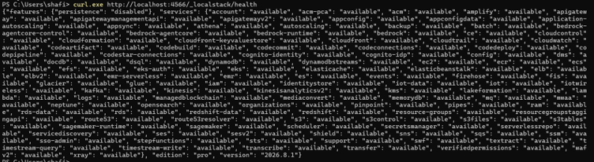
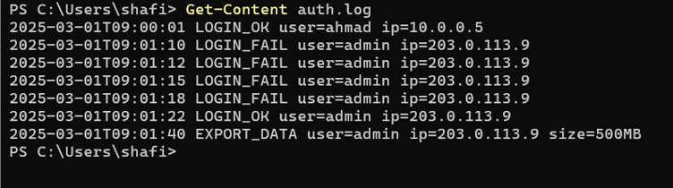
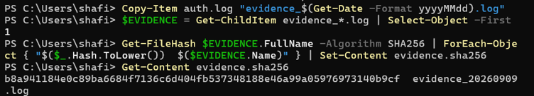

# IKB42603 Cloud Computing Security Essentials
# Lab 5 – Monitoring, Logging & Incident Detection

**Weeks:** 9–10  
**Topic:** Monitoring, Logging & Incident Detection  
**Tools:** Docker, LocalStack, AWS CLI  
**Environment:** Windows 11 / PowerShell  
**Student Name:** Nur Shafiqa Binti Ab Rahim  
**Student ID:** 52215124832  
**Date:** 09/09/2026

---

## 1. Objective

This laboratory focuses on monitoring, logging, and incident detection in a cloud-style environment using Docker and LocalStack.

The objectives of this lab are to:

1. Collect and centralise logs from multiple services.
2. Distinguish between logs and events and query security activity.
3. Build a tamper-evident, hash-chained log and detect alteration.
4. Detect an incident by correlating multiple events.
5. Perform a basic incident-response process consisting of detection, containment, evidence collection, integrity verification, and documentation.

---

## 2. Environment and Prerequisites

The laboratory was performed using:

- Windows 11
- Docker Desktop
- Docker container runtime
- LocalStack
- AWS CLI Version 2
- PowerShell

AWS CLI was configured to communicate with LocalStack rather than a real AWS account.

### AWS CLI configuration

```powershell
aws configure set aws_access_key_id test
aws configure set aws_secret_access_key test
aws configure set default.region us-east-1
aws configure set default.output json
```

The LocalStack endpoint was configured for the current PowerShell session:

```powershell
$EP="--endpoint-url=http://localhost:4566"
```

### LocalStack authentication

The current LocalStack release required authentication. A valid LocalStack Auth Token was configured through the environment before starting the container. The token itself is intentionally not included in this report.

LocalStack was started with:

```powershell
docker run -d --name localstack -p 4566:4566 -e LOCALSTACK_AUTH_TOKEN="$env:LOCALSTACK_AUTH_TOKEN" localstack/localstack
```

The LocalStack health endpoint confirmed that the `logs` service was available.



**Figure 1. LocalStack health check.**

### AWS CLI connectivity verification

```powershell
aws $EP sts get-caller-identity
```

Result:

```text
{
    "UserId": "000000000000",
    "Account": "000000000000",
    "Arn": "arn:aws:iam::000000000000:root"
}
```


**Figure 2. AWS CLI successfully communicating with LocalStack.**

---

# SESSION A – WEEK 9

## 3. Task 1 – Generate Sample Authentication Logs

A sample authentication log was created containing normal login activity, repeated failed logins, a successful login after the failures, and a suspicious data export.

The following log entries were created in `auth.log`:

```text
2025-03-01T09:00:01 LOGIN_OK user=ahmad ip=10.0.0.5
2025-03-01T09:01:10 LOGIN_FAIL user=admin ip=203.0.113.9
2025-03-01T09:01:12 LOGIN_FAIL user=admin ip=203.0.113.9
2025-03-01T09:01:15 LOGIN_FAIL user=admin ip=203.0.113.9
2025-03-01T09:01:18 LOGIN_FAIL user=admin ip=203.0.113.9
2025-03-01T09:01:22 LOGIN_OK user=admin ip=203.0.113.9
2025-03-01T09:01:40 EXPORT_DATA user=admin ip=203.0.113.9 size=500MB
```

The log was checked using:

```powershell
Get-Content auth.log
```



**Figure 3. Sample authentication and suspicious activity log.**

### Observation

The log contains:

- One successful login by `ahmad`.
- Four failed login attempts against `admin`.
- The four failures originated from `203.0.113.9`.
- A successful `admin` login then occurred from the same IP.
- A subsequent `EXPORT_DATA` event transferred `500MB`.

This sequence provides the evidence required for later incident correlation.

---

## 4. Task 2 – Centralise Logs in LocalStack

A CloudWatch Logs-style log group and log stream were created in LocalStack.

### Create the log group

```powershell
aws $EP logs create-log-group --log-group-name /ccse/app
```

### Create the log stream

```powershell
aws $EP logs create-log-stream --log-group-name /ccse/app --log-stream-name auth
```

The stream was verified with:

```powershell
aws $EP logs describe-log-streams --log-group-name /ccse/app
```

The resulting stream was:

```text
logStreamName: auth
storedBytes: 0
```

The seven log lines were then sent to the `auth` stream.

```powershell
$TS = [DateTimeOffset]::UtcNow.ToUnixTimeMilliseconds()
Get-Content auth.log | ForEach-Object {
    aws $EP logs put-log-events --log-group-name /ccse/app --log-stream-name auth --log-events "timestamp=$TS,message=$_"
    $TS += 1000
}
```

Seven successful sequence tokens were returned, confirming that all seven log events were accepted.

### Read-back verification

```powershell
aws $EP logs get-log-events --log-group-name /ccse/app --log-stream-name auth --query "events[].message" --output text
```

The original seven messages were successfully read back from the centralised log stream.


**Figure 4. Log events successfully stored and retrieved from LocalStack.**

### Result

The log data was successfully centralised in the `/ccse/app` log group under the `auth` stream. This demonstrates how logs from an application can be collected into a central logging service for monitoring and investigation.

---

## 5. Task 3 – Query Failed Login Activity

The authentication log was queried to identify the source IP responsible for failed login attempts.

PowerShell command used:

```powershell
Get-Content auth.log | Select-String "LOGIN_FAIL" | ForEach-Object { ($_ -split 'ip=')[1] } | Group-Object
```

Result:

```text
Count Name
----- ----
    4 203.0.113.9
```


**Figure 5. Failed-login activity grouped by source IP.**

### Observation

The query shows that:

- `203.0.113.9` generated **4 failed login attempts**.
- The repeated failures provide an indicator of possible brute-force activity.

### Event vs Log

An **event** is a single occurrence or activity, such as one `LOGIN_FAIL`.

A **log** is the recorded information about an event. It can contain details such as:

- Timestamp
- Event type
- Username
- Source IP address
- Other relevant activity details

For example:

```text
LOGIN_FAIL user=admin ip=203.0.113.9
```

represents a logged security event.

---

# SESSION B – WEEK 10

## 6. Task 4 – Tamper-Evident Hash-Chained Log

A hash chain was created to make changes to the log detectable.

For every log line, the SHA-256 hash was calculated from:

```text
previous_hash + current_log_line
```

The first previous hash was initialized to:

```text
0
```

### Generate the original hash chain

PowerShell implementation:

```powershell
$PREV = "0"
Get-Content auth.log | ForEach-Object {
    $INPUT = "$PREV$_"
    $PREV = [System.BitConverter]::ToString(
        [System.Security.Cryptography.SHA256]::Create().ComputeHash(
            [System.Text.Encoding]::UTF8.GetBytes($INPUT)
        )
    ).Replace("-","").ToLower()
    "$_ | $PREV"
} | Set-Content auth.chain
```

The resulting chain was displayed using:

```powershell
Get-Content auth.chain
```

Each log entry contained a corresponding 64-character SHA-256 hash.


**Figure 6. Original authentication log with SHA-256 hash chain.**

### Tampering simulation

The original log was deliberately modified by changing the data-export size from:

```text
size=500MB
```

to:

```text
size=5MB
```

Command:

```powershell
(Get-Content auth.log) -replace '500MB','5MB' | Set-Content auth.tampered
```

The tampered log was checked with:

```powershell
Get-Content auth.tampered
```

The final entry was now:

```text
EXPORT_DATA user=admin ip=203.0.113.9 size=5MB
```

### Recalculate the hash chain

The hash chain was recalculated using the modified file:

```powershell
$PREV = "0"
Get-Content auth.tampered | ForEach-Object {
    $INPUT = "$PREV$_"
    $PREV = [System.BitConverter]::ToString(
        [System.Security.Cryptography.SHA256]::Create().ComputeHash(
            [System.Text.Encoding]::UTF8.GetBytes($INPUT)
        )
    ).Replace("-","").ToLower()
}
$TAMPERED = $PREV
```

The original final hash and tampered final hash were then compared.


**Figure 7. Different final hashes demonstrate that the log was altered.**

### Result

The original final hash was:

```text
ababa78b74bf524d9dadca8c48e4909fc10579a6f17574f42cefe8f81233cf
```

The tampered final hash was:

```text
72f1d53774a3a938fa7bd3a88f67894e5a64055a41ee7511eac53d7bd89d859b
```

The comparison produced:

```text
Tampering detected : True
```

Therefore, changing even one value in the log caused the final hash to change, demonstrating the tamper-evident property of the hash chain.

---

## 7. Task 5 – Incident Detection by Correlation

The log was analysed by correlating three different types of activity from the same source IP:

1. Repeated failed login attempts.
2. A successful login.
3. A subsequent data-export event.

PowerShell implementation:

```powershell
$IP="203.0.113.9"
$FAILS=(Get-Content auth.log | Select-String "LOGIN_FAIL.*$IP").Count
$SUCCESS=(Get-Content auth.log | Select-String "LOGIN_OK.*$IP").Count
$EXPORT=(Get-Content auth.log | Select-String "EXPORT_DATA.*$IP").Count
Write-Host "IP=$IP fails=$FAILS success=$SUCCESS export=$EXPORT"

if ($FAILS -ge 3 -and $SUCCESS -ge 1 -and $EXPORT -ge 1) {
    Write-Host "ALERT: probable brute-force -> compromise -> data exfiltration"
}
```

Result:

```text
IP=203.0.113.9 fails=4 success=1 export=1
ALERT: probable brute-force -> compromise -> data exfiltration
```


**Figure 8. Correlation of authentication and data-export events.**

### Analysis

No single log line proves the complete incident.

- A single failed login may be harmless.
- A successful login may also be normal.
- A data export may be legitimate.

However, the combination of **four failed logins**, followed by a **successful login from the same IP**, followed by **data export** creates a suspicious sequence.

The correlation rule therefore identifies a probable:

**brute-force attack → account compromise → data exfiltration**

---

## 8. Task 6 – Incident Response

### 8.1 Detection

The incident was detected through event correlation.

The source IP was:

```text
203.0.113.9
```

The observed activity was:

```text
4 failed logins
        ↓
1 successful login
        ↓
1 data export
```

This satisfied the detection rule and generated an alert.

---

### 8.2 Containment

The suspicious IP address was blocked using an `iptables` rule inside an Alpine Linux container.

```powershell
docker run --rm --cap-add=NET_ADMIN alpine sh -c "apk add -q iptables; iptables -A INPUT -s 203.0.113.9 -j DROP; iptables -L INPUT -n | tail -2"
```

The resulting rule was:

```text
DROP    all    --    203.0.113.9    0.0.0.0/0
```


**Figure 9. Containment rule blocking the suspicious IP address.**

The purpose of containment is to limit further activity from the suspected source while preserving the available evidence for investigation.

---

### 8.3 Evidence Collection

The original authentication log was copied into an evidence file:

```powershell
Copy-Item auth.log "evidence_$(Get-Date -Format yyyyMMdd).log"
```

A SHA-256 integrity record was then generated:

```powershell
$EVIDENCE = Get-ChildItem evidence_*.log | Select-Object -First 1
Get-FileHash $EVIDENCE.FullName -Algorithm SHA256 | ForEach-Object { "$($_.Hash.ToLower())  $($EVIDENCE.Name)" } | Set-Content evidence.sha256
```

The evidence hash file contained:

```text
b8a941184e0c89ba6684f7136c6d404fb537348188e46a99a05976973140b9cf  evidence_20260909.log
```



**Figure 10. Preserved evidence and SHA-256 integrity hash.**

---

### 8.4 Evidence Integrity Verification

The stored hash was compared with a newly calculated hash:

```powershell
$EXPECTED = (Get-Content evidence.sha256).Split()[0]
$ACTUAL = (Get-FileHash (Get-ChildItem evidence_*.log | Select-Object -First 1).FullName -Algorithm SHA256).Hash.ToLower()
Write-Host "Expected : $EXPECTED"
Write-Host "Actual   : $ACTUAL"
Write-Host "Integrity: $($EXPECTED -eq $ACTUAL)"
```

Result:

```text
Expected : b8a941184e0c89ba6684f7136c6d404fb537348188e46a99a05976973140b9cf
Actual   : b8a941184e0c89ba6684f7136c6d404fb537348188e46a99a05976973140b9cf
Integrity: True
```


**Figure 11. Evidence hash verification confirms that the preserved log remains unchanged.**

---

# 9. Incident Report

## Detection

The monitoring system detected suspicious activity associated with IP address `203.0.113.9`. The log contained four failed login attempts against the `admin` account, followed by a successful login from the same IP address. A subsequent `EXPORT_DATA` event transferred `500MB`.

The correlation rule generated the following alert:

```text
ALERT: probable brute-force -> compromise -> data exfiltration
```

## Analysis

The sequence of events indicates a probable brute-force attack followed by account compromise and possible data exfiltration.

The four consecutive failed login attempts are consistent with password-guessing activity. The successful login from the same IP after the failures increases the likelihood that the account was compromised. The following `EXPORT_DATA` event is suspicious because it occurred from the same IP shortly after the successful login.

Correlation was necessary because no individual event alone established the complete incident.

## Containment

The suspected source IP `203.0.113.9` was blocked using an `iptables` DROP rule:

```text
DROP    all    --    203.0.113.9    0.0.0.0/0
```

This was performed to reduce the possibility of continued activity from the suspected source.

## Evidence & Integrity

The original `auth.log` was preserved as:

```text
evidence_20260909.log
```

Its SHA-256 hash was stored in:

```text
evidence.sha256
```

The recorded and recalculated hashes matched, producing:

```text
Integrity: True
```

The separate hash-chain test also demonstrated that modifying the original log changed the final hash and produced:

```text
Tampering detected : True
```

These results demonstrate two integrity controls: hash chaining for tamper detection and a SHA-256 evidence hash for verifying the preserved evidence file.

## Lesson Learned

Centralised logging makes security activity easier to search and correlate. Individual events may not reveal an incident, but combining authentication failures, successful authentication, and sensitive actions can expose a suspicious attack sequence. Logs should also be protected against modification and preserved with integrity information so they can support both investigation and later evidence requirements.

---

# 10. Questions and Answers

## Q1. What is the difference between a log and an event? Give examples.

An **event** is a single occurrence or activity generated by a system or application.

Example:

```text
LOGIN_FAIL user=admin ip=203.0.113.9
```

A **log** is the recorded information that stores details about one or more events, such as timestamps, usernames, IP addresses, and actions.

Example:

```text
2025-03-01T09:01:10 LOGIN_FAIL user=admin ip=203.0.113.9
```

Therefore, an event is the activity itself, while a log is the record used to store and analyse that activity.

---

## Q2. Why should audit logs be tamper-proof, and how does a hash chain achieve this?

Audit logs may be used to investigate security incidents and establish what happened. If an attacker can modify the logs, important evidence could be hidden or changed.

A hash chain makes modification detectable by calculating each hash from the previous hash and the current log entry:

```text
H1 = SHA256(0 + Event1)

H2 = SHA256(H1 + Event2)

H3 = SHA256(H2 + Event3)
```

If an earlier event is modified, its hash changes. That change affects the following hash values, ultimately changing the final hash. In this lab, changing `500MB` to `5MB` resulted in a different final hash and:

```text
Tampering detected : True
```

---

## Q3. How does correlation detect an incident when no single line reveals it?

Correlation combines multiple related events and looks for a suspicious sequence or pattern.

In this lab:

```text
4 × LOGIN_FAIL
        ↓
LOGIN_OK
        ↓
EXPORT_DATA
```

All of these activities were associated with `203.0.113.9`.

A single failed login may not be suspicious by itself. A successful login may also be normal. A data export may also be legitimate. However, the sequence of repeated failures followed by successful authentication and a large data export provides a much stronger indication of compromise and possible exfiltration.

---

## Q4. What are the incident-response steps performed in this lab and what is the goal of each?

| Step | Goal |
|---|---|
| Detection | Identify suspicious activity using log analysis and correlation. |
| Analysis | Understand the sequence and determine whether the activity is likely an incident. |
| Containment | Limit further activity from the suspected source. |
| Evidence collection | Preserve relevant logs for investigation. |
| Integrity verification | Prove that preserved evidence has not been modified. |
| Documentation | Record what happened, what actions were performed, and what was learned. |

The overall goal is to identify the incident, limit its impact, preserve evidence, and document the response in a structured way.

---

## Q5. How can the same logs support both security monitoring and compliance evidence?

The same centralised logs can be used for continuous security monitoring and later evidence collection.

For security monitoring, logs can be queried for patterns such as:

- Repeated failed logins.
- Successful logins after repeated failures.
- Suspicious IP addresses.
- Sensitive actions such as data exports.

For compliance and auditing, the logs can provide records of:

- Who performed an action.
- When the action occurred.
- Which source IP was involved.
- What security-relevant activity occurred.

Integrity mechanisms such as hash chains and SHA-256 hashes can strengthen the reliability of the records by making unauthorised modification detectable.

---

# 11. Security Checklist

| Security Requirement | Status | Evidence |
|---|---|---|
| Logs centralised | Completed | `task2.png` |
| Failed logins queryable | Completed | `task3.png` |
| Logs made tamper-evident | Completed | `task4.1.png`, `task4.2.png` |
| Incident detected by correlation | Completed | `task5.png` |
| Suspicious source contained | Completed | `task6.1.png` |
| Evidence collected | Completed | `task6.2.png` |
| Evidence integrity verified | Completed | `verify.png` |
| Incident documented | Completed | Incident Report section |

---

# 12. Verification

The lab manual specifies verification of the LocalStack log group and evidence integrity.

### Verify LocalStack log groups

```powershell
aws $EP logs describe-log-groups
```

The expected log group is:

```text
/ccse/app
```

### Verify evidence integrity

The PowerShell equivalent used in this Windows environment was:

```powershell
$EXPECTED = (Get-Content evidence.sha256).Split()[0]
$ACTUAL = (Get-FileHash (Get-ChildItem evidence_*.log | Select-Object -First 1).FullName -Algorithm SHA256).Hash.ToLower()
Write-Host "Expected : $EXPECTED"
Write-Host "Actual   : $ACTUAL"
Write-Host "Integrity: $($EXPECTED -eq $ACTUAL)"
```

Final result:

```text
Integrity: True
```

---

# 13. Deliverables Summary

The following laboratory deliverables were completed:

- [x] Centralised `get-log-events` read-back.
- [x] Failed-login count grouped by IP.
- [x] Hash-chained log.
- [x] Tampering demonstration and detection.
- [x] Incident correlation alert.
- [x] Containment rule.
- [x] Evidence file and SHA-256 integrity hash.
- [x] Evidence integrity verification.
- [x] Incident report.
- [x] Q1–Q5 answers.
- [x] Security checklist.

---

# 14. Conclusion

Lab 5 demonstrated a complete basic monitoring and incident-detection workflow.

First, authentication activity was recorded and centralised in a LocalStack CloudWatch Logs-style environment. The centralised logs were then queried to identify repeated failed login attempts.

A SHA-256 hash chain was created to make log modification detectable. When the data-export size was deliberately changed from `500MB` to `5MB`, the final hash changed and the tampering test successfully reported `True`.

The lab then demonstrated security-event correlation. Four failed login attempts from `203.0.113.9`, followed by a successful login and a data-export event, generated an alert indicating a probable brute-force attack followed by compromise and data exfiltration.

Finally, an incident-response workflow was performed by detecting the incident, containing the suspected IP, preserving the original log as evidence, generating a SHA-256 evidence hash, and verifying that the evidence remained unchanged.

Overall, the laboratory demonstrated how centralised logging, event correlation, tamper-evident records, and evidence integrity can work together to support cloud security monitoring and incident response.

---

# 15. Evidence File List

Place the screenshots in an `evidence lab5` folder beside this Markdown file using the following filenames:

```text
evidence lab5/
├── setup1.1.png
├── setup1.2.png
├── task1.png
├── task2.png
├── task3.png
├── task4.1.png
├── task4.2.png
├── task5.png
├── task6.1.png
├── task6.2.png
└── verify.png
```

These filenames correspond to the evidence figures used throughout this report.
