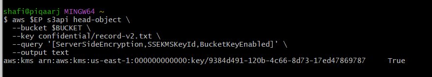
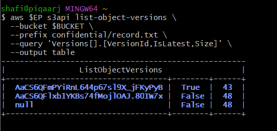
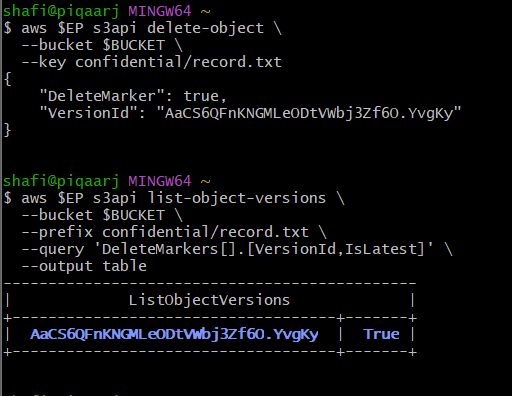
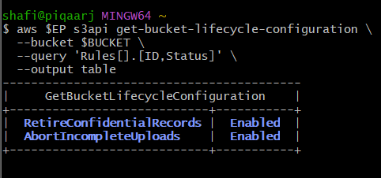
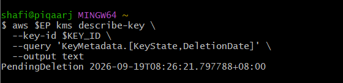
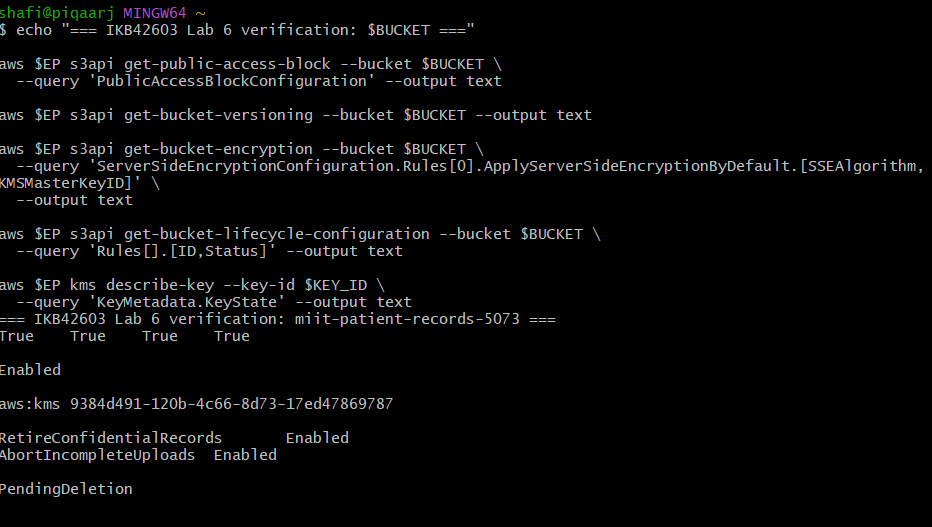

# IKB42603 Cloud Computing Security Essentials --- Lab 6

## Object Storage Security & the Data Security Lifecycle

**Student:** Nur Shafiqa binti Ab Rahim\
**Student ID:** 52215124832\
**Class:** L03\
**Platform:** Amazon S3 on LocalStack

------------------------------------------------------------------------

## 1. Task 1 --- Data Classification

A hospital patient-record bucket was created and three objects were
stored with classification tags.

**Bucket:** `miit-patient-records-5073`

  -----------------------------------------------------------------------------
  Classification    Who may read it   Impact if leaked  Control applied
  ----------------- ----------------- ----------------- -----------------------
  Public            General users     Low impact;       Public classification
                                      intended for      tag; later protected by
                                      public            bucket-level
                                      information       public-access controls

  Internal          Authorised staff  Exposure of       Least-privilege access
                                      operational       scoped to `internal/*`
                                      information       

  Confidential      Authorised        Disclosure of     SSE-KMS, restricted
                    personnel only    sensitive patient access, versioning,
                                      information       lifecycle retention and
                                                        cryptographic-erasure
                                                        capability
  -----------------------------------------------------------------------------

The object listing confirmed:

-   `confidential/record.txt`
-   `internal/roster.txt`
-   `public/notice.txt`

The confidential object was tagged with:

`classification = confidential`

### Evidence


------------------------------------------------------------------------

## 2. Task 2 --- Reproduce the Public Bucket Breach

A deliberately insecure bucket policy used:

``` json
"Principal": "*"
```

with `s3:GetObject` permission over all objects in the bucket.

An anonymous HTTP request successfully retrieved the confidential
patient record:

``` text
HTTP 200
Patient: Ahmad bin Ali, Diagnosis: confidential
```

This demonstrated that no credentials or exploit were required. The
resource policy itself exposed the data.

### Evidence


### Key finding

The single element that caused the exposure was **`Principal: "*"`**,
because it allowed any principal, including anonymous users, to perform
the permitted `s3:GetObject` action.

------------------------------------------------------------------------

## 3. Task 3 --- Remediation with Block Public Access

The public bucket policy was removed and all four Block Public Access
settings were enabled:

-   `BlockPublicAcls = true`
-   `IgnorePublicAcls = true`
-   `BlockPublicPolicy = true`
-   `RestrictPublicBuckets = true`

LocalStack still returned `HTTP 200` for the anonymous read after the
public policy was reintroduced. This is a LocalStack enforcement
limitation noted in the lab manual. The configuration itself was stored
correctly.

A least-privilege bucket policy was then applied:

``` text
arn:aws:s3:::miit-patient-records-5073/internal/*
```

This limited the intended bucket-policy access to the internal prefix
rather than the entire bucket.

### Evidence


------------------------------------------------------------------------

## 4. Task 4 --- Identity Policy vs Resource Policy

An IAM user named `DataAnalyst` was created with an identity-based
policy allowing:

``` text
s3:GetObject
s3:ListBucket
Resource: *
```

The bucket resource policy then contained:

-   an Allow statement for the analyst to read `internal/*`
-   an explicit Deny statement for the analyst over `confidential/*`

The internal object request succeeded:

``` text
internal: ALLOWED
```

The confidential request unexpectedly also succeeded in LocalStack. The
policy documents themselves were verified and contained the expected
explicit Deny.

### AWS policy evaluation

The expected evaluation logic is:

1.  Default deny
2.  An explicit Deny overrides an Allow
3.  If no explicit Deny applies, an explicit Allow can grant access

Therefore, on real AWS, the explicit `DenyAnalystConfidential`
resource-policy statement would override the IAM Allow for the
confidential object.

### Evidence


------------------------------------------------------------------------

## 5. Task 5 --- Default Encryption at Rest (SSE-KMS)

A dedicated KMS key was created for the patient-records bucket.

**KMS Key ID:**

`9384d491-120b-4c66-8d73-17ed47869787`

Default bucket encryption was configured using:

``` text
SSEAlgorithm: aws:kms
BucketKeyEnabled: true
```

An object was uploaded without specifying an encryption option manually.
The `head-object` output confirmed that the bucket automatically applied
SSE-KMS:

``` text
aws:kms
arn:aws:kms:us-east-1:000000000000:key/9384d491-120b-4c66-8d73-17ed47869787
True
```

This demonstrates that encryption was enforced as a bucket property
rather than relying on the uploader to remember an encryption flag.

### Evidence



------------------------------------------------------------------------

## 6. Task 6 --- Delegated Access and Secure Transport

### Presigned URL

A presigned URL was generated for:

``` text
internal/roster.txt
```

with a 60-second expiry.

The first request successfully returned:

``` text
Staff duty schedule, week 12
HTTP 200
```

After waiting 65 seconds, LocalStack still returned:

``` text
after expiry: HTTP 200
```

The URL itself contained the expected signing parameters, including
`X-Amz-Date`, `X-Amz-Expires=60`, and `X-Amz-Signature`.

This demonstrates the intended security model: a presigned URL delegates
access to a specific object for a bounded period, but anyone holding the
URL before expiry can use it.

### SecureTransport condition-key trap

A bucket policy was applied with:

``` json
"Condition": {
  "Bool": {
    "aws:SecureTransport": "false"
  }
}
```

The policy was successfully stored, but the subsequent S3 request was
still allowed by LocalStack.

The reason is that the lab uses the LocalStack HTTP endpoint:

``` text
http://localhost:4566
```

The lab manual notes that LocalStack may not fully enforce this
condition-key behaviour. On real AWS, S3 is accessed through HTTPS, so
the condition must be evaluated in the environment where the policy is
deployed.

### Evidence


------------------------------------------------------------------------

## 7. Task 7 --- Versioning, Delete Markers and Data Remanence

Versioning was enabled on the bucket.

Three versions of `confidential/record.txt` were observed:

  Version                            Latest     Size
  ---------------------------------- -------- ------
  v3 --- `[REDACTED]`                True         43
  v2 --- `hypertension`              False        43
  Original Task 1 version (`null`)   False        48

The object was then deleted. Instead of removing all historical data, S3
created a delete marker:

``` text
DeleteMarker = true
IsLatest = true
```

The original version could still be retrieved explicitly using:

``` text
--version-id null
```

The recovered content was:

``` text
Patient: Ahmad bin Ali, Diagnosis: confidential
```

This proves object-level data remanence: a normal delete operation did
not destroy the historical version.

### Evidence






------------------------------------------------------------------------

## 8. Task 8 --- Lifecycle, Retention and Cryptographic Erasure

A lifecycle configuration was applied with two enabled rules:

  -----------------------------------------------------------------------------
  Rule                          Status                  Purpose
  ----------------------------- ----------------------- -----------------------
  `RetireConfidentialRecords`   Enabled                 Expire objects under
                                                        `confidential/` after
                                                        365 days and noncurrent
                                                        versions after 30 days

  `AbortIncompleteUploads`      Enabled                 Abort incomplete
                                                        multipart uploads after
                                                        7 days
  -----------------------------------------------------------------------------

### Cryptographic erasure

The bucket's KMS key was disabled and scheduled for deletion with a
seven-day pending window.

The final key state was:

``` text
PendingDeletion
```

Deletion date:

``` text
2026-09-19T08:26:21.797788+08:00
```

A subsequent S3 read of `confidential/record-v2.txt` still succeeded in
LocalStack and reported SSE-KMS metadata. The lab manual explicitly
notes that LocalStack may not re-check the KMS key state when reading an
object.

The security principle remains that destroying the encryption key makes
ciphertext inaccessible once the key is actually unavailable. This
provides a way to make data unrecoverable without physically destroying
shared cloud storage media.

### Evidence






------------------------------------------------------------------------

# Short-Answer Questions

## 1. Which single element caused the Task 2 exposure, and why is `Principal: "*"` more dangerous on a bucket policy than an over-broad IAM policy attached to one user?

The single element was **`Principal: "*"`**. It allowed the
`s3:GetObject` action to any principal, including anonymous users. A
broad IAM policy is attached to a particular identity, whereas a bucket
resource policy can expose the named resource directly to a much wider
population. Therefore, `Principal: "*"` in a bucket policy can create
anonymous public access to the affected objects.

## 2. Explain the difference between an identity-based policy and a resource-based policy. In Task 4, which one decided each analyst request?

An **identity-based policy** is attached to an IAM identity and defines
what that identity is allowed to do. A **resource-based policy** is
attached directly to a resource such as an S3 bucket and defines which
principals can access that resource.

For the internal request, the effective policy set contained an Allow
for the analyst to access `internal/*`.

For the confidential request, the bucket policy contained an explicit
Deny for `confidential/*`. Under AWS policy evaluation, that explicit
Deny overrides the IAM Allow.

LocalStack did not enforce the expected Deny during this run, but the
policy documents demonstrated the intended evaluation outcome.

## 3. Block Public Access is described as a guardrail rather than a control. What is the difference, and why does the distinction matter for an organisation with many engineers?

A control can directly implement a particular access decision, while a
guardrail prevents or limits unsafe configurations across the
environment. Block Public Access acts as a preventative safety layer
against public S3 access.

This matters in an organisation with many engineers because it reduces
dependence on every individual engineer remembering to configure every
bucket correctly. A preventative guardrail can stop a dangerous
configuration before it becomes an exposure.

## 4. The bucket has default SSE-KMS encryption. Does that protect the confidential record from the analyst in Task 4?

No. SSE-KMS protects **data at rest** by encrypting the object and
managing its encryption key through KMS. It does not decide whether an
authenticated principal is authorised to read the object.

Therefore, an analyst who is authorised by IAM and resource policies can
still request the object. Access control and encryption at rest solve
different security problems.

## 5. A patient invokes their right to erasure. Why is `delete-object` alone not compliant, and what two mechanisms would make deletion more provable?

With versioning enabled, `delete-object` creates a delete marker while
previous versions remain recoverable. Therefore, the original
confidential data can still exist underneath the current delete marker.

Two mechanisms that improve provability are:

1.  **Delete every object version and delete marker explicitly**, with
    evidence of the resulting empty version listing.
2.  **Cryptographic erasure** by destroying or making unavailable the
    KMS key that protects the data, so the remaining ciphertext cannot
    be decrypted.

Lifecycle rules can also automate retention and noncurrent-version
expiration, but they do not by themselves provide immediate erasure.

## 6. As the Week 11 auditor, name three commands whose output would be collected as compliance evidence and state which control each evidences.

  ---------------------------------------------------------------------------------------------------------
  Command                                                               Evidence
  --------------------------------------------------------------------- -----------------------------------
  `aws $EP s3api get-public-access-block --bucket $BUCKET`              Block Public Access configuration

  `aws $EP s3api get-bucket-encryption --bucket $BUCKET`                Default SSE-KMS encryption

  `aws $EP s3api get-bucket-lifecycle-configuration --bucket $BUCKET`   Retention and lifecycle policy
  ---------------------------------------------------------------------------------------------------------

Other useful evidence commands include `get-bucket-versioning`,
`head-object`, `list-object-versions`, and `kms describe-key`.

------------------------------------------------------------------------

# Final Verification

Final security posture:

``` text
=== IKB42603 Lab 6 verification: miit-patient-records-5073 ===

BlockPublicAcls        True
IgnorePublicAcls       True
BlockPublicPolicy      True
RestrictPublicBuckets  True

Enabled

aws:kms  9384d491-120b-4c66-8d73-17ed47869787

RetireConfidentialRecords    Enabled
AbortIncompleteUploads       Enabled

PendingDeletion
```

The final configuration demonstrates:

-   Block Public Access enabled on all four settings
-   S3 versioning enabled
-   Default SSE-KMS encryption enabled
-   Lifecycle retention rules enabled
-   KMS key scheduled for deletion

### Evidence



------------------------------------------------------------------------

# Security Best-Practices Checklist

-   [x] Every object carries a classification tag before access
    decisions.
-   [x] No intended bucket policy grants anonymous access; anonymous
    access was tested during the breach simulation.
-   [x] Block Public Access is enabled on all four flags.
-   [x] Access is scoped to a key prefix for least privilege.
-   [x] Default encryption is `aws:kms` using a customer-managed KMS
    key.
-   [x] Sharing was demonstrated using a time-bounded presigned URL.
-   [x] Versioning is enabled and delete markers were demonstrated.
-   [x] Lifecycle rules express retention requirements.
-   [x] Cryptographic erasure was demonstrated by disabling and
    scheduling deletion of the KMS key.

------------------------------------------------------------------------

# Conclusion

Lab 6 demonstrated the full object-storage data security lifecycle:
classification, exposure, remediation, authorisation, encryption,
delegated access, versioning, retention and cryptographic erasure.

The LocalStack environment did not fully enforce several behaviours that
would normally be enforced by AWS, including presigned URL expiry, the
`aws:SecureTransport` condition and re-checking KMS key state during an
S3 read. These limitations were recorded rather than treated as
successful security enforcement.

The final bucket configuration nevertheless demonstrated the intended
security controls and provided command outputs that can be used as
compliance evidence.
